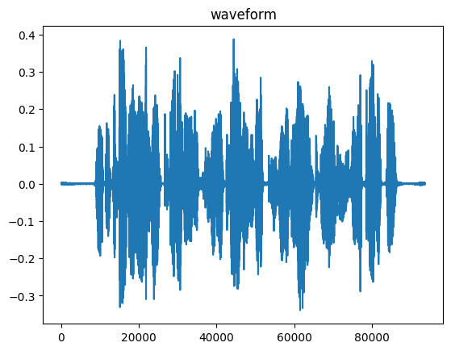
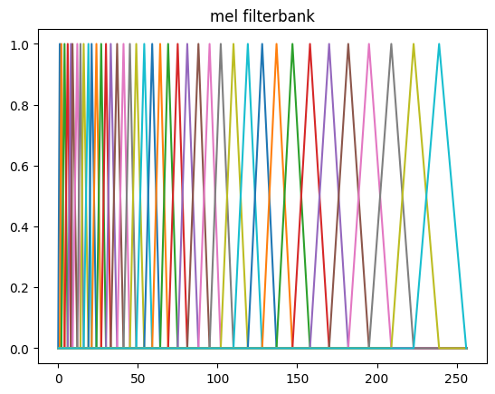
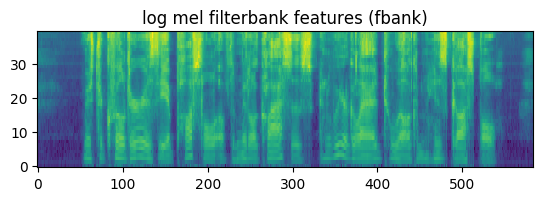

# Module 2 Lab

## Feature extraction for speech recognition

### Instructions

Instructions:

In this lab, you will write the core functions necessary to perform feature extraction on audio waveforms.
Your program will convert an audio file to a sequence of log mel frequency filterbank ("FBANK") coefficients.

The basic steps in features extraction are

1. Pre-emphasis of the waveform
2. Dividing the signal into overlapping segments or frames
3. For each frame of audio:
  * Windowing the frame
  * Computing the magnitude spectrum of the frame
  * Applying the mel filterbank to the spectrum to create mel filterbank coefficients
  * Applying a logarithm operation to the mel filterbank coefficient

In the lab, you will be supplied with python file called **speech_sigproc.py**.
This file contains a partially completed python class called **FrontEnd** that performs feature extraction, using methods that perform the steps listed above.
The methods for dividing the signal into frames (step 2) will be provided for you, as will the code for generating the coefficients of the mel filterbank that is used in step 3c.
You are responsible for filling in the code in all the remaining methods.

There are two top-level python scripts that call this class.
The first is called **M2_Wav2Feat_Single.py**. This function reads a single pre-specified audio file, computes the features, and writes them to a feature file in HTK format.

In the first part of this lab, you are to complete the missing code in the **FrontEnd** class and then modify **M2_Wav2Feat_Single.py** to plot the following items:

1. Waveform
2. Mel frequency filterbank
3. Log mel filterbank coefficients

You can compare the figures to the figures below.
Once the code is verified to be working, the feature extraction program should be used to create feature vector files for the training, development, and test sets.
This will be done using **M2_Wav2Feat_Batch.py**.
This program takes a command line argument **–-set** (or **-s** ) which takes as an argument either **train** , **dev** , or **test**. For example

**$ python M2_Wav2Feat_Batch.py –set train**

This program will use the code you write in the FrontEnd class to compute feature extraction for all the files in the LibriSpeech corpus.
You need to call this program 3 times, once each for train, dev, and test sets.

When the training set features are computed ( **--set train** ) the code will also generate the global mean and precision (inverse standard deviation) of the features in the training set.
These quantities will be stored in two ASCII files in the **am** direction for use by CNTK during acoustic model training in the next module.

Here are the outputs you should get from plotting: 

